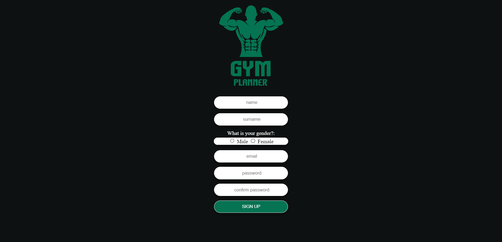
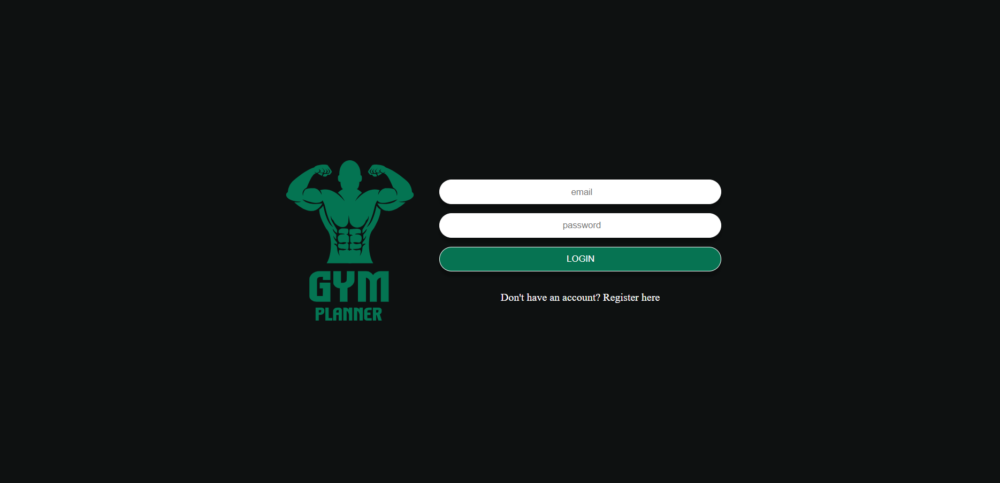
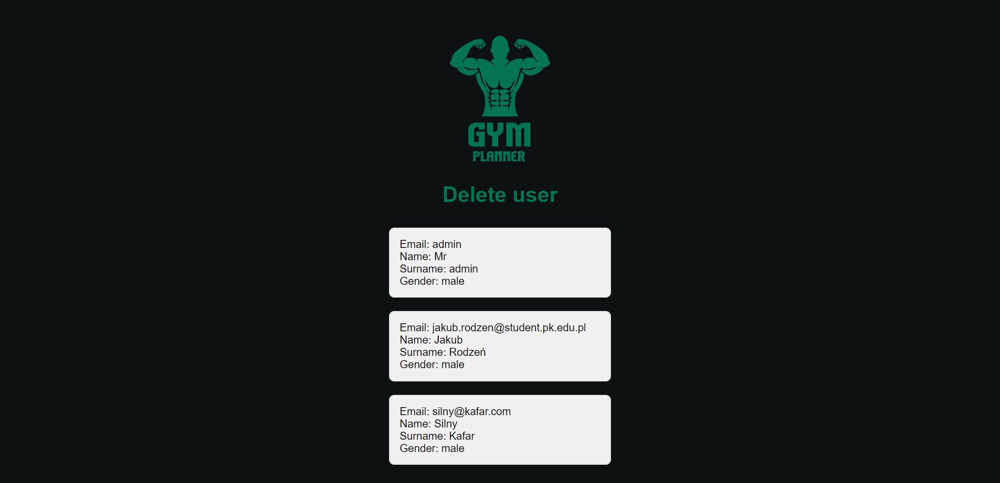
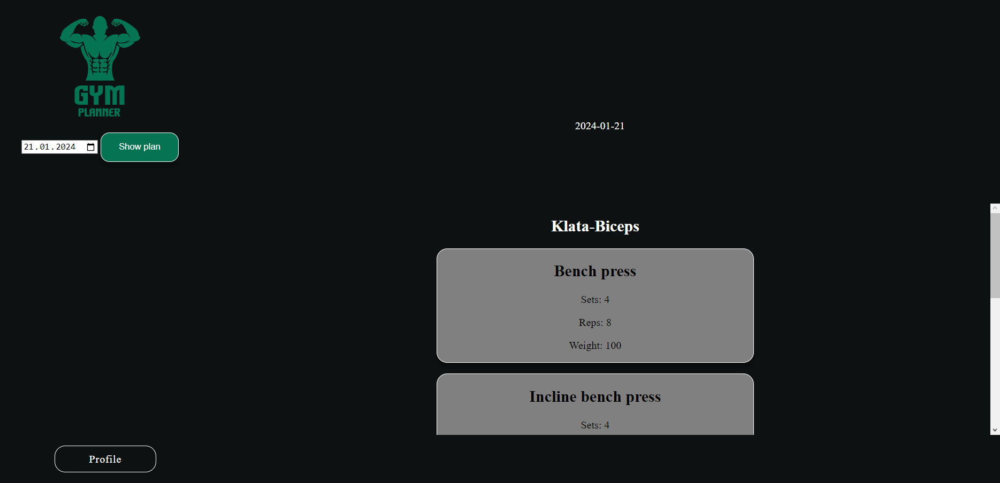

# GYM Planner
Welcome to GYM Planner! An application that enables easy creation and management of your personalized workout plans.

## Introduction
This document provides an overview of the GYM Planner application, designed to simplify the process of creating and managing personalized workout plans. Whether you're a fitness enthusiast or a professional trainer, GYM Planner offers a user-friendly platform to help you achieve your fitness goals.

## Features

- **Create Workout Plans:** Develop a customized workout plan tailored to your fitness goals.
- **Add Exercises:** Incorporate various exercises into your plan along with details on repetitions and sets.
- **Browse Plans:** Review your workout plans effortlessly.

## Docker containers

**NGINX** (Web Server):
Responsible for serving static files and handling HTTP requests.

**PHP**:
Manages dynamic content and interactions on the server-side.

**PostgreSQL** (pgsql):
A database container for storing user information, transactions, and other relevant data.

**pgAdmin4**:
Provides a web-based interface for PostgreSQL administration.

##Application features

## User Authentication

### Login and Registration Views:

#### Registration Process:

1. **User Data Input:**
   - Users provide their registration data using a registration form, including email address, password, name, surname, gender, and any other required fields.

2. **Client-Side Verification:**
   - JavaScript scripts on the website validate the entered email address, ensuring the correct format.
   - Passwords are checked for minimum length and the inclusion of special characters.
   - The system verifies if the entered passwords match and if all required fields are completed.

3. **Server-Side Verification:**
   - The server checks if the provided email is unique. If the email is already registered, an error message is returned.
   - Additional server-side validation ensures data integrity and security.

4. **Password Hashing:**
   - Before storing user information in the database, the system securely hashes the password, enhancing data security.

5. **Registration Decision:**
   - If the email is unique and all validation passes, the user is redirected to the login page, confirming successful registration.
   - In case of validation errors or a non-unique email, an error message is displayed, prompting the user to correct the information.

#### Login Process:

1. **User Authentication Input:**
   - Users provide their email and password for authentication through a login form.

2. **Database Authentication:**
   - The system communicates with the PostgreSQL database to verify the existence of the provided email and its corresponding hashed password.

3. **Authentication Decision:**
   - If the email and password match, the server grants access, allowing the user to proceed.
   - In case of no match or an error, an error message is returned, indicating unsuccessful authentication.

4. **Account Type Check:**
   - The system determines the type of account (e.g., buyer or customer) by checking both the User and Admin tables based on the provided email.

### Logout Process:

1. **Logout Action:**
   - When the user clicks the "Log out" button, cookies associated with the user session are deleted.

2. **Redirection:**
   - After the logout action, the user is redirected to the login page.

Adjust the details according to your application's specific functionalities and database structure.

Admin Features
User Management
As an admin, you have additional privileges for managing users within the GYM Planner application. These features include:

Delete User
Admins can seamlessly remove users from the system, providing an efficient way to handle user accounts that need to be deactivated or removed entirely.

To delete a user:

###Admin Features

##User Management

As an admin, you have additional privileges for managing users within the GYM Planner application.
Admins can seamlessly remove users from the system, providing an efficient way to handle user accounts that need to be deactivated or removed entirely.

To delete a user:

1. **Access the Admin Panel section.**
   
3. **View the list of users displayed, including their email, name, surname, and gender.**
   
5. **Click on the user you wish to delete.**
6. **Confirm the deletion through a prompt or dedicated button.**
Admins play a crucial role in maintaining a secure and well-organized user database. The ability to delete users ensures that only valid and authorized individuals have access to the GYM Planner application.

###User Features

##Personalized Workout Plans

As a user of the GYM Planner application, you can enjoy a range of features that empower you to create your personalized workout plan. The GYM Planner application aims to provide a user-friendly experience, making it easier for you to achieve your fitness objectives. Customize your workout plans, track your progress, and stay motivated on your fitness journey.

